# Hi there! 

## ⭐ About Me

🎓 I am Firdaus Al Ghifari, a software engineer with experiences in back-end (Golang, Ruby on Rails, Python, Java), front-end (React, Flutter), and machine learning (TensorFlow, PyTorch). Currently, I work as a Software Engineer at Money Forward 🇯🇵. I'm deeply passionate about solving business problems using technology to help people achieve their goals effectively.

👨‍💻 Previously, I worked at Pintarnya 🇮🇩 as a Software Engineer, where I developed its job-seeking platform using Golang, Python, GCP, and PostgreSQL. The app achieved 1 million downloads in a little more than a year.

🏠 Outside of work, I am also passionate about building a business or startup. One particular project, Purwalenta.com, had around 4000 monthly active users. I managed the engineering team to build a web and Android app using Kotlin, React, Django, and AWS.

🎸 I loved to play sports, especially Badminton, Tennis, and Basketball. I also like meeting new people over a cup of coffee. Feel free to [connect and reach out to me](https://www.linkedin.com/in/alghi/).

🏅 Achievements: TensorFlow Certified Developer, Most Outstanding Student on Entrepreneurship Faculty of Computer Science Universitas Indonesia '22, ACM ICPC Asia Jakarta National Bronze Medalist '19.

## 📈 Stats

    
     
    

